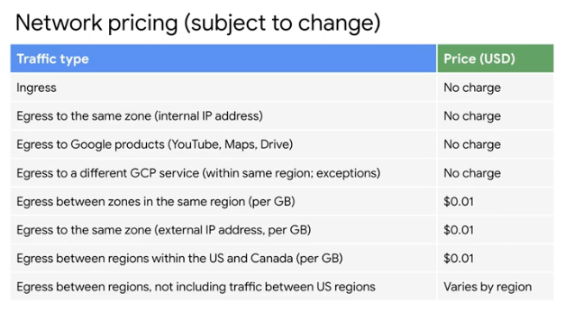

# Google Cloud Fundamentals: Core Infrastructure

## Cloud Computing Definition

1. Customers get computing resources **on-demand** and via **self-service**
2. Resources are accessed over the network
3. Cloud provider has a big pool of resources and allocates to customers out of the pool
4. Resources are **elastic**, and therefore scalable
5. Pay as you go (or reserve)

## GCP Computing Architecure

* IaaS ---> Hybrid ---> PaaS (App Engine) ---> Serverless logic (Cloud functions) ---> Automated elastic resources (Managed services)&#x20;
* Google network is made of up hundreds of thousands kilometers of fiber cable, including subsea cables, more than 90 Internet exchanges and more than 100 Internet Points of Presence.&#x20;

## Regions and Zones&#x20;

* Services can be zonal, regional, or managed by Google across regions&#x20;
* A zone is a deployment area for GCP resources within a region.&#x20;
  * Single failure domain within a region&#x20;
  * For more fault tolerant apps, deploy across multiple zones&#x20;
  * Google Compute Engine VM are specific zone
* Regions are independent geographic areas that are made up of _zones_.
  * Disaster recovery plan necessary to recover your application if an entire primary region is lost&#x20;
  * Regional resources are deployed with redundancy within a region
* Multi-regional resources are managed by Google to be redundant and distributed across regions. Some tradeoffs may be necessary in terms of latency or consistency. Examples:
  * Google App Engine&#x20;
  * Google Cloud Datastore&#x20;
  * Google Cloud Storage&#x20;
  * Google BigQuery&#x20;

## Pricing&#x20;

* Per-second billing for IaaS compute engine, K8, and more&#x20;
* Auto-applied sustained-use discounts for certain services
* Online pricing calculator can help estimate costs&#x20;
* Open APIs and Open source services give customers ability to run applications via other CSP if Google is no longer a good fit&#x20;

## Security&#x20;

### Overview

* Security is designed into every layer of GCP technical infrastructure.&#x20;

| Layer                   | Notable security mesaures                                                                         |
| ----------------------- | ------------------------------------------------------------------------------------------------- |
| Operational Security    | IDS, insider threat risk reduction measures, employee Universal 2nd Factor (U2F) use, secure SDLC |
| Internet communication  | Google Front End service, DoS protection built in                                                 |
| Storage services        | Encryption at rest                                                                                |
| User Identity           | Central Identity service w/ U2F support                                                           |
| Service deployment      | Encryption of inter-service communication (via remote procedure - RPC- calls)                     |
| Hardware infrastructure | Hardware designed and built by Google, secure boot stack, premises security                       |

### Shared-responsibility&#x20;

### Resource Hierarchy Levels

* Levels of hierarchy provide trust boundaries and resource isolation&#x20;
* .png>)
* Resources (VM, Storage Bucket, etc.) --> Project(s) --> Folder(s) --> Organization&#x20;
  * All resources are organized into projects.
  * Projects can optionally be organized into folders, which can also contain subfolders
  * Folders and projects can be grouped together under an organization node

#### Policies&#x20;

* Inherited downwards in the hierarchy&#x20;
* Each level in the hierarchy can have policies defined to apply permissions, etc.&#x20;
* Can also be applied to individual resources&#x20;

#### Projects

* All services and resources belong to a GCP console project&#x20;
* Three identifying attributes:&#x20;

| Attribute      | Scope              | Grantor         | Mutability |
| -------------- | ------------------ | --------------- | ---------- |
| Project ID     | Globally unique    | Chosen by you   | Immutable  |
| Project name   | Need not be unique | Chosen by you   | Mutable    |
| Project number | Globally unique    | Assigned by GCP | Immutable  |

* Projects are used for:
  * Tracking resource and quota usage&#x20;
  * Billing
  * Managing permissions and credentials&#x20;
  * Enabling services and APIs&#x20;
* _Google Cloud Resource Manager_ API is used to programmatically manage projects in GCP. Accessed via REST API or RPC API
  * Get a list of all projects associated with the account&#x20;
  * Create new projects&#x20;
  * Update existing projects&#x20;
  * Delete projects&#x20;
  * Recover projects&#x20;
*

## Services&#x20;

### Compute&#x20;

* Compute Engine
* Kubernetes Engine
* App Engine&#x20;
* Cloud Functions&#x20;

### Storage&#x20;

* Bigtable&#x20;
* Cloud Storage&#x20;
* Cloud SQL
* Cloud Spanner
* Cloud Datastore&#x20;

### Big Data&#x20;

* BigQuery
* Pub/Sub
* Dataflow&#x20;
* Dataproc
* Datalab

### Machine learning

* Natural Language API
* Vision API
* Machine Learning
* Speech API
* Translate API
*
